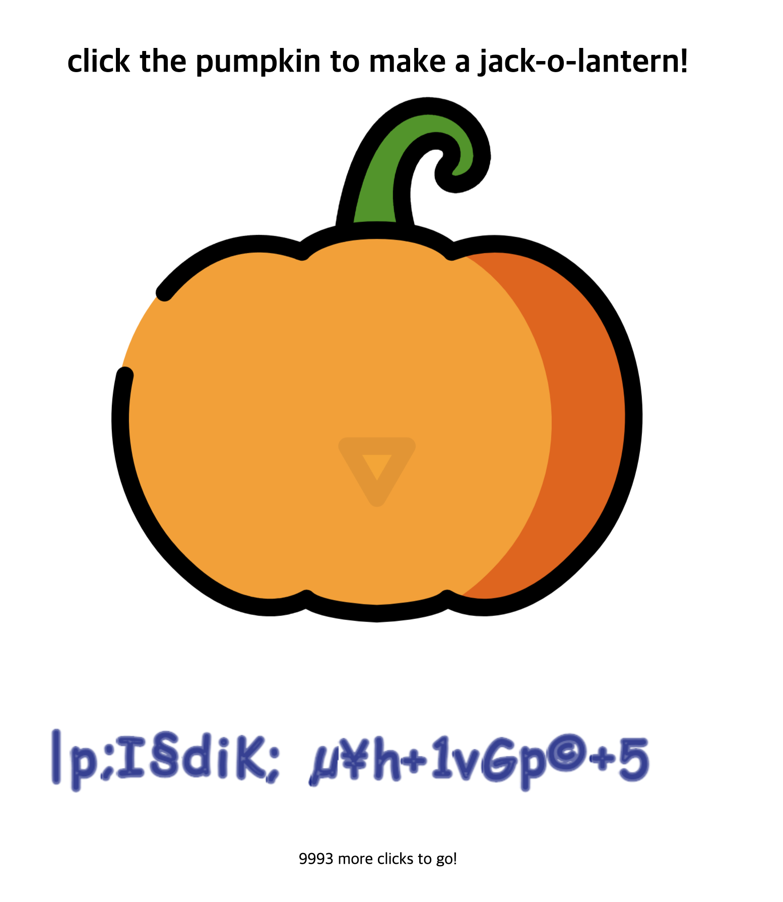
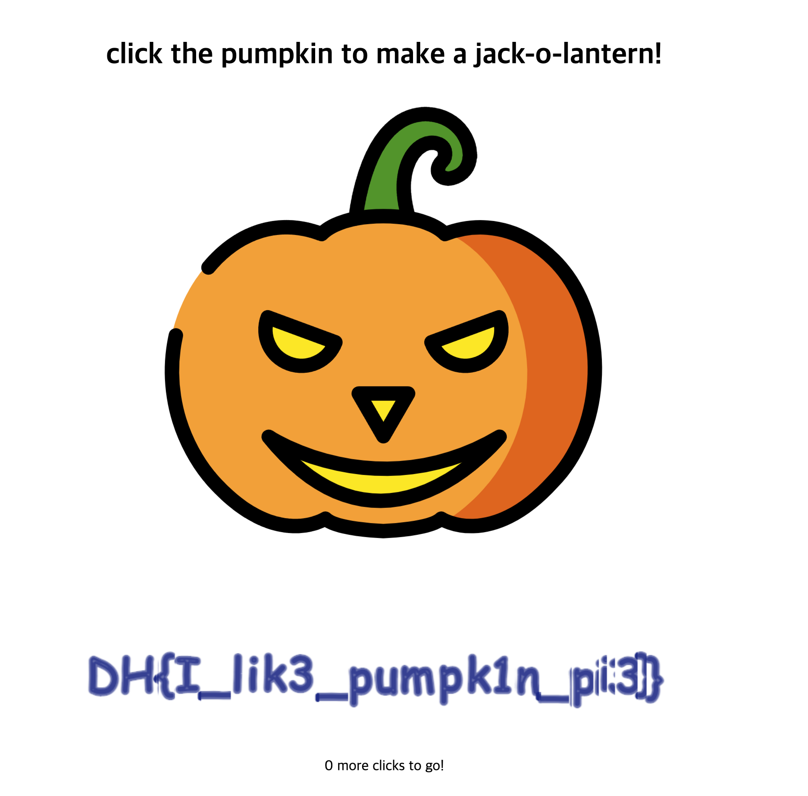

## 코드

```js
<script>
var pumpkin = [ 124, 112, 59, 73, 167, 100, 105, 75, 59, 23, 16, 181, 165, 104, 43, 49, 118, 71, 112, 169, 43, 53 ];
var counter = 0;
var pie = 1;

function make() {
  if (0 < counter && counter <= 1000) {
    $('#jack-nose').css('opacity', (counter) + '%');
  }
  else if (1000 < counter && counter <= 3000) {
    $('#jack-left').css('opacity', (counter - 1000) / 2 + '%');
  }
  else if (3000 < counter && counter <= 5000) {
    $('#jack-right').css('opacity', (counter - 3000) / 2 + '%');
  }
  else if (5000 < counter && counter <= 10000) {
    $('#jack-mouth').css('opacity', (counter - 5000) / 5 + '%');
  }

  if (10000 < counter) {
    $('#jack-target').addClass('tada');
    var ctx = document.querySelector("canvas").getContext("2d"),
    dashLen = 220, dashOffset = dashLen, speed = 20,
    txt = pumpkin.map(x=>String.fromCharCode(x)).join(''), x = 30, i = 0;

    ctx.font = "50px Comic Sans MS, cursive, TSCu_Comic, sans-serif"; 
    ctx.lineWidth = 5; ctx.lineJoin = "round"; ctx.globalAlpha = 2/3;
    ctx.strokeStyle = ctx.fillStyle = "#1f2f90";

    (function loop() {
      ctx.clearRect(x, 0, 60, 150);
      ctx.setLineDash([dashLen - dashOffset, dashOffset - speed]); // create a long dash mask
      dashOffset -= speed;                                         // reduce dash length
      ctx.strokeText(txt[i], x, 90);                               // stroke letter

      if (dashOffset > 0) requestAnimationFrame(loop);             // animate
      else {
        ctx.fillText(txt[i], x, 90);                               // fill final letter
        dashOffset = dashLen;                                      // prep next char
        x += ctx.measureText(txt[i++]).width + ctx.lineWidth * Math.random();
        ctx.setTransform(1, 0, 0, 1, 0, 3 * Math.random());        // random y-delta
        ctx.rotate(Math.random() * 0.005);                         // random rotation
        if (i < txt.length) requestAnimationFrame(loop);
      }
    })();
  }
  else {
    $('#clicks').text(10000 - counter);
  }
}

$(function() {
  $('#jack-target').click(function () {
    counter += 1;
    if (counter <= 10000 && counter % 100 == 0) {
      for (var i = 0; i < pumpkin.length; i++) {
        pumpkin[i] ^= pie;
        pie = ((pie ^ 0xff) + (i * 10)) & 0xff;
      }
    }
    make();
  });
});
</script>
```

## 풀이

10000번의 클릭을 해야 하는 문제
당연히 직접 클릭하진 않을거고, 두가지 접근법이 있다.

1. 남은 클릭 수를 0으로 조작하는 방법
2. 클릭 이벤트를 구현해서 10000번 실행시키는 것

1번 방법이 가장 간단하지만, 코드를 보면 실제로 flag 값을 담고 있는 pumpkin 배열을 참조하는 것은 클릭 이벤트이다.
10000번 이상 클릭했는지 체크하는 곳에서는 애니메이션으로 String을 보여주는 역할을 할 뿐이다.



따라서 2번 방법으로 풀어야하고,
친절하게 jQuery로 작성되어있으므로 그대로 사용하면 된다.

다음과 같이 코드를 작성해서 개발자도구에 입력한다.

```js
for (var i = 0; i < 10000; i++) {
    $('#jack-target').click()
}
```

남은 한번은 직접 클릭하면 된다!

